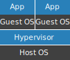
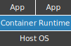

.. _containers:

Containers
==========

Virtualisation - Virtual Machines vs. Containers
------------------------------------------------

With the increase in processing power of hardware there was a desire to make better use of the increased resources.
Essentially a mechanism that allowed us to stuff more things onto a single host. From this desire,
:term:`Virtual Machines<Virtual Machine>` were born. :abbr:`VMs (Virtual Machines)` at their heart are a hardware
virtualisation technology. Their intent it to abstract away the hardware allowing multiple
:term:`Operating Systems<OS>` to co-exist on a single host. The bit that makes this work is called a Hypervisor.

The figure below shows a simplified diagram of what a typical host might look like when running virtual machines.

    figure 1: A traditional VM Host

You can see that on top of the underlying host :abbr:`OS (Operating System)` there is the Hypervisor, which in turn
allows multiple guest operating systems to co-exist. One of the key advantages of Virtual Machines is that the host and
guest operating systems do not need to be the same, the hypervisor is emulating the hardware itself. Each virtual
machine is a self contained full operating system stack.

Many improvements have been made since their introduction with built in hardware support in more recent CPUs along with
the hypervisor slowly moving down the stack to the point were it can effectively replace the underlying OS all by
itself in some instances.

Being a hardware virtualisation technology does have it's drawbacks. Perhaps most important here is that each VM is
it's own world with all that entails. Nothing is shared between the VMs. This means, amongst other things, that booting
a VM is like booting a real hardware machine. It takes time.

Containers take a different approach. Rather than virtualising at the hardware level, they do so at the software level.
For Docker_ specifically the virtualisation occurs at the kernel level, arguably it isn't even really virtualisation.
The applications share the hardware and the kernel, they are just isolated from each other by means of mechanisms build
into the Linux kernel itself. Namely, :abbr:`cgroups (control groups)` which allow limiting of resources as well as
auditing hooks and prioritization controls.

    figure 2: A container host

The figure above hopefully highlights the difference when using containers to isolate application compared to virtual
machines. You can see that in the place of the hypervisor is a container runtime and that the "guest os" sections is
missing entirely. This highlights the main difference between virtual machines and containers. Containers do not need a
full guest operating system to run your applications inside. Instead, you just run your application directly and the
container runtime takes care of sharing only those resources that the application needs or should have access to.

The biggest advantage of containers is related to this, because there is no need for a guest operating system you can
start and stop a application really quickly. There is no boot process, it's really not that much different from running
a normal application directly on your host.

Another interesting difference is that within a virtual machine you tend to run many different processes. e.g. The
application itself, backing services such as a database and HTTP hosts/reverse proxies such as nGinx. In containers
this is still technically possible but there is a strong preference towards single purpose containers. So instead of
running everything inside a single container you would instead run a container *per* process type. This leads to some
interesting patterns around architecture and orchestration.

Why Developers Love Containers
------------------------------

The 10th factor specified in `12 factor apps`_ is **"Dev/prod parity"** which is the desire to keep the development,
staging and production environments as similar as possible. One aspect of that is as they describe it *tools*. It can
be appealing to use light-weight alternatives in development such as SQLite_ rather than Postgres_ which is used in
production. These light-weight alternatives are usually easier to get up and running and don't need much in the way of
maintenance. Frameworks like Django_ make this pretty easy, they provide an abstraction on top of those services like
the :abbr:`ORM (Object Relational Mapper)` which sits on top of the database and the caching framework which sits on
top of services that can be used for caching.

The problem with this is that like all abstractions they are leaky. The don't quite make everything behave exactly the
same way and these differences can bite you at exactly the wrong time, like when deploying to production.

As such it is preferable to work with exactly the same backing services locally as you do on the staging and production
environments. This usually isn't too difficult to do, just install those services on your local machine and configure
you application to connect to them. This works, but has a few drawbacks.

Firstly, what if your day to day involves working on multiple projects? One may use MySQL_ another Postgres_ and a
third one a completely non-relational database. You now need to keep 3 separate services up and running and remember to
ensure each project has it's own data store properly isolated within it.

Another issue is having to work on different projects that require different versions of backing services. You may be
asked to work on a critical bugfix in an old application that has to work against a really old version of a backing
service. You can, and probably *should*, take the time to ensure that it can work against newer versions but this is,
as mentioned, **critical** and needs fixing immediately. To be certain you have fixed the issue you may need to
uninstall the newer version you already had installed so you can get the older one up and running.

What about sharing your configuration with other developers on your team, for example a new starter? Stepping through
the set up process could be fairly time consuming and require other members of the team for a large amount of time to
get things up and running.

These issue can be roughly grouped into the categories of Parity, Isolation, and Repeatability. All these categories
can be more easily dealt with using containers (and Virtual Machines to be fair).  Within each project you can provide
a definition of all the backing services and tools needed. This is distributed and managed in exactly the same way as
the source code itself. So once someone has gotten hold of the code, they have everything they need to get up and
running locally with an environment that closely resembles the production one.

As containers are lighter than true Virtual Machines it is a quick process to spin up or stop all the backing services
for a project. Allowing you to ensure that you are using the most appropriate backing service and version for the
project you are working on. It this can easily done on a per-project basis and each project is kept well isolated from
the others.

What is Docker?
---------------

Docker_ is the name of the company behind the docker engine and related tooling. More normally when we use the name
Docker_ we mean the docker engine - a container runtime originally developed for Linux but now available for Windows
and macOS too. It is by far the most widely used set of tools for working with containers today.

Docker_ is used to build images, as well as running containers. Images can be thought of like a blue-print or a
``class`` definition whereas containers are like the actual house, or object created from it.

Installation
------------

There are 2 versions of Docker talked about on their website. Docker-CE (Community Edition) and Docker-EE
(Enterprise Edition). The community addition has everything we are going to need at this point. The enterprise edition
bring with it a lot more tooling around certification and trust as well as container orchestration.

Detailed and up to date instructions for the installation of Docker_ can be found on the `community edition`_ section
of their website.

Once you have Docker_ itself installed I would also highly recommend installing docker-compose_. Currently this is
installed automatically as part of the macOS and Windows installers. Linux users will need to install it separately.

.. _docker: https://www.docker.com
.. _cgroups: https://en.wikipedia.org/wiki/Cgroups
.. _`12 factor apps`: https://12factor.net/
.. _sqlite: https://www.sqlite.org/
.. _postgres: https://www.postgresql.org/
.. _django: https://www.djangoproject.com/
.. _mysql: https://www.mysql.com/
.. _`community edition`: https://www.docker.com/community-edition
.. _docker-compose: https://docs.docker.com/compose/install/
